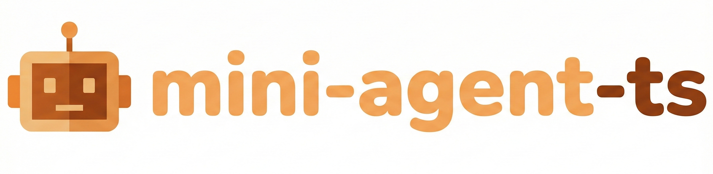

<div align="center">
  
  <h1>mini-agent-ts</h1>
  <p>
    
    
    
    
  </p>
</div>

> This project is a TypeScript implementation of MiniMax's open-source [Mini-Agent](https://github.com/MiniMax-AI/Mini-Agent) project.

**mini-agent-ts** is a minimal and powerful terminal AI Agent with **~2,000** lines of core code. It supports **Agent Skills**, **MCP**, and multiple LLM providers (OpenAI/Anthropic compatible). Built with native file operations and command execution tools, it's perfect for developers who want to learn Agent implementation or build their own AI assistant.

---

## ✨ Key Features

- 🔄 **ReAct Mode**: Multi-step reasoning and tool calling for complex tasks
- 🧠 **Interleaved Chain of Thought**: Tightly integrates reasoning with tool execution
- 🔌 **MCP Protocol**: Connect to external tool ecosystems seamlessly
- 🛠️ **Agent Skills**: Customize domain expertise through knowledge bases
- 🌐 **Multi-Provider**: OpenAI, Anthropic, MiniMax, DeepSeek, and any OpenAI-compatible API

---

## 📦 Installation

```bash
# Clone repository
git clone https://github.com/Code-MonkeyZhang/mini-agent-ts.git
cd mini-agent-ts

# Install dependencies
npm install

# Build and link
npm run build && npm link
```

---

## 🚀 Quick Start

**1. Copy configuration**

```bash
cp config/config-example.yaml config/config.yaml
```

**2. Configure** (`config/config.yaml`)

_Set your API key and endpoint_:

```yaml
apiKey: 'your-api-key-here'
apiBase: 'https://api.minimaxi.com/v1/' # or your provider's endpoint

# Model and provider
model: 'MiniMax-M2.1'
provider: 'openai' # openai or anthropic
```

**3. Run**

```bash
mini-agent-ts
```

That's it! You have a working AI Agent in your terminal.

---

## 🔧 Configuration

### Environment Variables

| Variable        | Description                       | Default  |
| --------------- | --------------------------------- | -------- |
| `apiKey`        | Your LLM provider API key         | Required |
| `apiBase`       | API endpoint URL                  | Required |
| `model`         | Model name                        | Required |
| `provider`      | SDK type: `openai` or `anthropic` | `openai` |
| `enableLogging` | Enable runtime logging            | `false`  |

### MCP Servers

Add external tools via MCP protocol:

```bash
cp config/mcp-example.json config/mcp.json
```

Edit `config/mcp.json`:

```json
{
  "mcpServers": {
    "time-server": {
      "command": "uvx",
      "args": ["mcp-server-time"],
      "description": "Provides current time query"
    }
  }
}
```

### Agent Skills

Add custom skills to extend Agent capabilities:

```yaml
tools:
  skillsDir: './skills'
```

Create skill files in `skills/` directory following the [Agent Skills](https://agentskills.io) format.

---

## 📖 Project Structure

```
mini-agent-ts/
├── src/
│   ├── agent.ts        # Core agent loop (ReAct)
│   ├── cli.ts          # CLI entry point
│   ├── config.ts       # Configuration loader
│   ├── llm-client/     # LLM provider adapters
│   ├── schema/         # Data models
│   ├── skills/         # Skills loader
│   └── tools/          # Built-in tools
├── config/
│   ├── config.yaml     # Main config
│   └── mcp.json        # MCP servers
├── skills/             # User skills
└── tests/              # Tests
```

---

## 🤝 Contributing

Issues and Pull Requests are welcome!

---

## 📚 Reference

- [OpenAI API](https://platform.openai.com/docs/api-reference/chat)
- [Anthropic Messages API](https://docs.anthropic.com/en/api/messages)
- [Model Context Protocol](https://modelcontextprotocol.io)
- [Agent Skills](https://agentskills.io)

---

### Made with ❤️ by [Code-MonkeyZhang](https://github.com/Code-MonkeyZhang)
